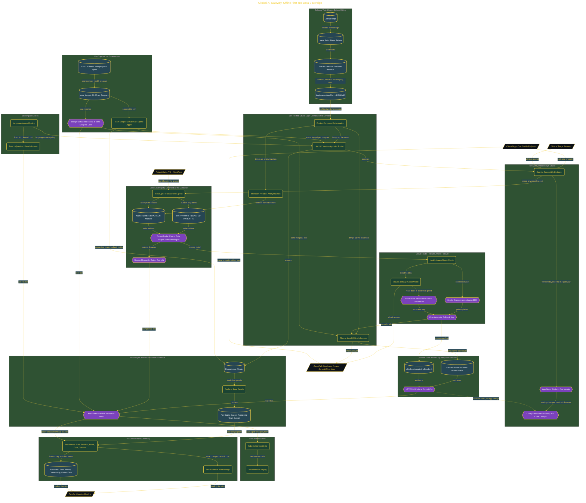

# Build a Clinical-AI Gateway

> Inside the [Global Problem Systems Engineering](../../README.md) portfolio · *Population-scale systems built for civic and public-good outcomes.*

## Overview

In this build, I created a self-hosted, vendor-agnostic Clinical-AI gateway for healthcare programs that need reliable diagnostic support in offline or low-resource settings. The system was designed to keep clinical AI access available even when cloud connectivity, vendor access, or budget limits create pressure on the care path.

The gateway gave clinical applications one OpenAI-compatible endpoint instead of forcing them to bind directly to one vendor. That kept the app contract stable while the gateway handled cloud routing, local fallback, cost controls, and data-sovereignty rules behind it.

This mattered because healthcare AI pilots often fail before reaching patients. They depend on cloud-only paths, brittle vendor bindings, unclear spend controls, or data movement that does not respect local policy. The gateway was built to make the AI layer more portable, safer to govern, and more realistic for constrained environments.

The architecture is built across **7 phases**, anchored by **The Problem: Why AI Pilots Never Reach a Patient** on the input side and **The Population-Impact Briefing: Getting the Gateway Funded** at the end. Each phase is listed in the Implementation section below.

## Architecture

The diagram shows the topology and data flow of the system as built. The full architectural narrative, with screenshots and prose, lives in [`documents/clinical-ai-gateway.md`](./documents/clinical-ai-gateway.md).

## Implementation

This system is built across **7 phases**:

1. **The Problem: Why AI Pilots Never Reach a Patient**
2. **Standing Up the Clinical-AI Gateway Stack**
3. **Proving the Contract and the Offline Floor**
4. **Implementing Data Sovereignty and Clinical Safety**
5. **Health-Aware Failover, Multilingual Access, and Per-Capita Cost Governance**
6. **The Funder Dashboard and Five-Bar Validation Drills**
7. **The Population-Impact Briefing: Getting the Gateway Funded**

For the full walkthrough with screenshots and step-by-step content, see [`documents/clinical-ai-gateway.md`](./documents/clinical-ai-gateway.md).

## Validation

Each build phase below is documented in [`documents/clinical-ai-gateway.md`](./documents/clinical-ai-gateway.md), with screenshots, configuration, and notes as captured during the build:

- ✅ The Problem: Why AI Pilots Never Reach a Patient
- ✅ Standing Up the Clinical-AI Gateway Stack
- ✅ Proving the Contract and the Offline Floor
- ✅ Implementing Data Sovereignty and Clinical Safety
- ✅ Health-Aware Failover, Multilingual Access, and Per-Capita Cost Governance
- ✅ The Funder Dashboard and Five-Bar Validation Drills
- ✅ The Population-Impact Briefing: Getting the Gateway Funded
