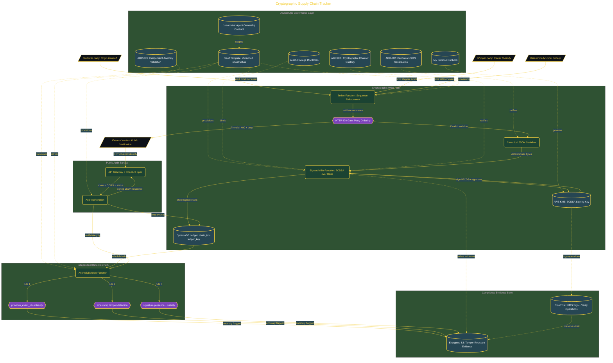

# Cryptographic Supply Chain Tracker

> Inside the [Global Problem Systems Engineering](../../README.md) portfolio · *Population-scale systems built for civic and public-good outcomes.*

## Overview

-T-h-i-s- -p-r-o-j-e-c-t- -b-u-i-l-d-s- -a- -s-e-r-v-e-r-l-e-s-s- -s-u-p-p-l-y- -c-h-a-i-n- -t-r-a-c-k-i-n-g- -s-y-s-t-e-m- -t-h-a-t- -c-r-y-p-t-o-g-r-a-p-h-i-c-a-l-l-y- -s-i-g-n-s- -e-v-e-r-y- -h-a-n-d-o-f-f- -b-e-t-w-e-e-n- -p-a-r-t-i-e-s- -t-o- -c-r-e-a-t-e- -v-e-r-i-f-i-a-b-l-e- -p-r-o-o-f- -o-f- -c-u-s-t-o-d-y- -a-c-r-o-s-s- -t-h-e- -f-u-l-l- -l-i-f-e-c-y-c-l-e- -o-f- -a- -p-r-o-d-u-c-t-.-
-
-T-h-e- -s-y-s-t-e-m- -a-d-d-r-e-s-s-e-s- -a- -c-o-r-e- -w-e-a-k-n-e-s-s- -i-n- -m-o-d-e-r-n- -s-u-p-p-l-y- -c-h-a-i-n-s-:- -t-h-e- -i-n-a-b-i-l-i-t-y- -t-o- -p-r-o-v-e- -w-h-a-t- -a-c-t-u-a-l-l-y- -h-a-p-p-e-n-e-d- -b-e-t-w-e-e-n- -o-r-g-a-n-i-z-a-t-i-o-n-s- -d-u-r-i-n-g- -t-r-a-n-s-i-t-.- -T-r-a-d-i-t-i-o-n-a-l- -t-r-a-c-k-i-n-g- -s-y-s-t-e-m-s- -r-e-c-o-r-d- -e-v-e-n-t-s-,- -b-u-t- -t-h-e-y- -d-o- -n-o-t- -g-u-a-r-a-n-t-e-e- -i-n-t-e-g-r-i-t-y- -o-r- -a-u-t-h-e-n-t-i-c-i-t-y-.- -T-h-i-s- -c-r-e-a-t-e-s- -g-a-p-s- -w-h-e-r-e- -t-i-m-e-s-t-a-m-p-s- -c-a-n- -b-e- -a-l-t-e-r-e-d-,- -c-u-s-t-o-d-y- -r-e-c-o-r-d-s- -s-k-i-p-p-e-d-,- -o-r- -p-r-o-d-u-c-t-s- -s-u-b-s-t-i-t-u-t-e-d- -w-i-t-h-o-u-t- -r-e-l-i-a-b-l-e- -d-e-t-e-c-t-i-o-n-.- -T-h-e- -a-r-c-h-i-t-e-c-t-u-r-e- -i-s- -m-o-d-e-l-e-d- -a-r-o-u-n-d- -r-e-a-l---w-o-r-l-d- -f-a-i-l-u-r-e-s- -s-u-c-h- -a-s- -t-h-e- -2-0-2-5- -c-o-n-t-a-m-i-n-a-t-e-d- -i-n-f-a-n-t- -f-o-r-m-u-l-a- -i-n-c-i-d-e-n-t-,- -w-h-e-r-e- -m-i-s-s-i-n-g- -o-r- -u-n-v-e-r-i-f-i-a-b-l-e- -h-a-n-d-o-f-f- -r-e-c-o-r-d-s- -c-r-e-a-t-e-d- -u-n-c-e-r-t-a-i-n-t-y- -a-r-o

The architecture is built across **11 phases**, anchored by **The Crisis This System Was Built to Solve** on the input side and **💎 Secret Mission: SLSA L1 Compliance Dashboard** at the end. Each phase is listed in the Implementation section below.

## Architecture

The diagram shows the topology and data flow of the system as built. The full architectural narrative, with screenshots and prose, lives in [`documents/cryptographic-supply-chain-tracker.md`](./documents/cryptographic-supply-chain-tracker.md).

## Implementation

This system is built across **11 phases**:

1. **The Crisis This System Was Built to Solve**
2. **Setting Up the DevSecOps Environment**
3. **Deploying the Full Serverless Stack**
4. **Building the Infrastructure with Agent 1**
5. **Simulating the 3-Party Supply Chain with Agent 2**
6. **Cryptographic Signing with AWS KMS via Agent 3**
7. **Detecting Anomalies and Chain Breaks with Agent 4**
8. **Building the Public Audit API with Agent 5**
9. **Generating Leadership Effectiveness Artifacts**
10. **Running 4 Crisis-Inspired End-to-End Scenarios**
11. **💎 Secret Mission: SLSA L1 Compliance Dashboard**, -.

For the full walkthrough with screenshots and step-by-step content, see [`documents/cryptographic-supply-chain-tracker.md`](./documents/cryptographic-supply-chain-tracker.md).

## Validation

Build outcomes verified end-to-end. Each phase below is captured with screenshots, configuration, and observable behavior in [`documents/cryptographic-supply-chain-tracker.md`](./documents/cryptographic-supply-chain-tracker.md):

- ✅ The Crisis This System Was Built to Solve
- ✅ Setting Up the DevSecOps Environment
- ✅ Deploying the Full Serverless Stack
- ✅ Building the Infrastructure with Agent 1
- ✅ Simulating the 3-Party Supply Chain with Agent 2
- ✅ Cryptographic Signing with AWS KMS via Agent 3
- ✅ Detecting Anomalies and Chain Breaks with Agent 4
- ✅ Building the Public Audit API with Agent 5
- ✅ Generating Leadership Effectiveness Artifacts
- ✅ Running 4 Crisis-Inspired End-to-End Scenarios
