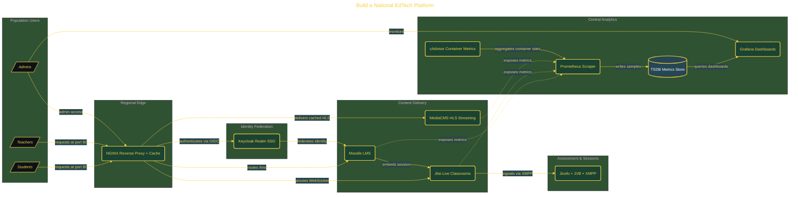

# Build a National EdTech Platform

> Inside the [Global Problem Systems Engineering](../../README.md) portfolio · *Population-scale systems built for civic and public-good outcomes.*

## Overview

-T-h-i-s- -p-r-o-j-e-c-t- -b-u-i-l-d-s- -a- -l-a-b---s-c-a-l-e- -n-a-t-i-o-n-a-l- -e-d-u-c-a-t-i-o-n- -p-l-a-t-f-o-r-m- -m-o-d-e-l-e-d- -a-f-t-e-r- -I-n-d-i-a-'-s- -D-I-K-S-H-A- -a-r-c-h-i-t-e-c-t-u-r-e-.-
-
-T-h-e- -s-y-s-t-e-m- -o-r-c-h-e-s-t-r-a-t-e-s- -1-5- -D-o-c-k-e-r- -c-o-n-t-a-i-n-e-r-s- -i-n-t-o- -a- -f-e-d-e-r-a-t-e-d- -p-l-a-t-f-o-r-m- -t-h-a-t- -i-n-c-l-u-d-e-s- -a-n- -L-M-S-,- -l-i-v-e- -v-i-d-e-o- -c-l-a-s-s-r-o-o-m-s-,- -v-i-d-e-o---o-n---d-e-m-a-n-d- -s-t-r-e-a-m-i-n-g-,- -s-i-n-g-l-e- -s-i-g-n---o-n-,- -e-d-g-e- -c-a-c-h-i-n-g-,- -a-n-d- -r-e-a-l---t-i-m-e- -o-b-s-e-r-v-a-b-i-l-i-t-y-.- -A-l-l- -s-e-r-v-i-c-e-s- -a-r-e- -e-x-p-o-s-e-d- -t-h-r-o-u-g-h- -a- -s-i-n-g-l-e- -e-n-t-r-y- -p-o-i-n-t-,- -s-i-m-u-l-a-t-i-n-g- -h-o-w- -a- -n-a-t-i-o-n-a-l---s-c-a-l-e- -e-d-u-c-a-t-i-o-n- -s-y-s-t-e-m- -w-o-u-l-d- -o-p-e-r-a-t-e- -u-n-d-e-r- -u-n-i-f-i-e-d- -a-c-c-e-s-s-.- -T-h-e- -g-o-a-l- -i-s- -n-o-t- -j-u-s-t- -f-e-a-t-u-r-e- -p-a-r-i-t-y-,- -b-u-t- -d-e-m-o-n-s-t-r-a-t-i-n-g- -h-o-w- -d-i-s-t-r-i-b-u-t-e-d- -s-y-s-t-e-m-s- -i-n-t-e-g-r-a-t-e- -i-n-t-o- -a- -c-o-h-e-s-i-v-e- -p-l-a-t-f-o-r-m- -w-i-t-h- -i-d-e-n-t-i-t-y-,- -t-r-a-f-f-i-c- -r-o-u-t-i-n-g-,- -a-n-d- -m-o-n-i-t-o-r-i-n-g- -b-u-i-l-t- -i-n- -f-r-o-m- -t-h-e- -s-t-a-r-t-.-

The architecture is built across **9 phases**, anchored by **Setting Up the Environment and Scaffolding the Platform** on the input side and **Multi-State Identity Federation and Custom Monitoring** at the end. Each phase is listed in the Implementation section below.

## Architecture

The diagram shows the topology and data flow of the system as built. The full architectural narrative, with screenshots and prose, lives in [`documents/national-edtech-platform.md`](./documents/national-edtech-platform.md).

## Implementation

This system is built across **9 phases**:

1. **Setting Up the Environment and Scaffolding the Platform**
2. **Orchestrating 15 Containers with Docker Compose and NGINX**
3. **Configuring Keycloak Identity Federation**
4. **Wiring Moodle to Keycloak SSO and Embedding Live Classrooms**
5. **Building a Course with Live Video and On-Demand Content**
6. **Deploying Real-Time Observability with Prometheus, Grafana, and cAdvisor**
7. **Adding Edge Caching and Benchmarking Platform Performance**
8. **Documenting the Architecture and Evaluating Against DIKSHA**
9. **Multi-State Identity Federation and Custom Monitoring**, -
-
-.

For the full walkthrough with screenshots and step-by-step content, see [`documents/national-edtech-platform.md`](./documents/national-edtech-platform.md).

## Validation

Build outcomes verified end-to-end. Each phase below is captured with screenshots, configuration, and observable behavior in [`documents/national-edtech-platform.md`](./documents/national-edtech-platform.md):

- ✅ Setting Up the Environment and Scaffolding the Platform
- ✅ Orchestrating 15 Containers with Docker Compose and NGINX
- ✅ Configuring Keycloak Identity Federation
- ✅ Wiring Moodle to Keycloak SSO and Embedding Live Classrooms
- ✅ Building a Course with Live Video and On-Demand Content
- ✅ Deploying Real-Time Observability with Prometheus, Grafana, and cAdvisor
- ✅ Adding Edge Caching and Benchmarking Platform Performance
- ✅ Documenting the Architecture and Evaluating Against DIKSHA
- ✅ Multi-State Identity Federation and Custom Monitoring
