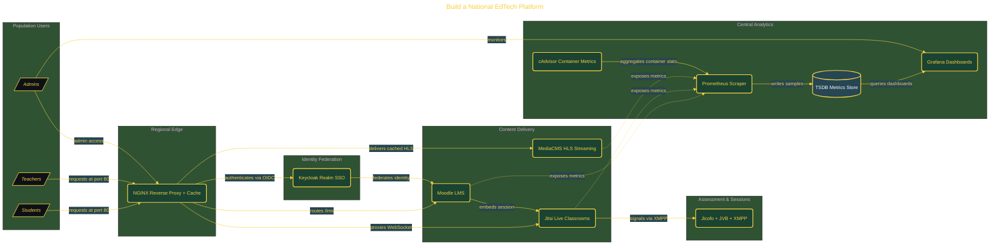

# Build a National EdTech Platform

> Inside the [Global Problem Systems Engineering](../../README.md) portfolio · *Population-scale systems built for civic and public-good outcomes.*

## Overview

This project builds a lab-scale national education platform modeled after India's DIKSHA architecture.

The system orchestrates 15 Docker containers into a federated platform that includes an LMS, live video classrooms, video-on-demand streaming, single sign-on, edge caching, and real-time observability. All services are exposed through a single entry point, simulating how a national-scale education system would operate under unified access. The goal is not just feature parity, but demonstrating how distributed systems integrate into a cohesive platform with identity, traffic routing, and monitoring built in from the start.

The architecture is built across **9 phases**, anchored by **Setting Up the Environment and Scaffolding the Platform** on the input side and **Multi-State Identity Federation and Custom Monitoring** at the end. Each phase is listed in the Implementation section below.

## Architecture

The diagram shows the topology and data flow of the system as built. The full architectural narrative, with screenshots and prose, lives in [`documents/national-edtech-platform.md`](./documents/national-edtech-platform.md).

## Implementation

This system is built across **9 phases**:

1. **Setting Up the Environment and Scaffolding the Platform**
2. **Orchestrating 15 Containers with Docker Compose and NGINX**
3. **Configuring Keycloak Identity Federation**
4. **Wiring Moodle to Keycloak SSO and Embedding Live Classrooms**
5. **Building a Course with Live Video and On-Demand Content**
6. **Deploying Real-Time Observability with Prometheus, Grafana, and cAdvisor**
7. **Adding Edge Caching and Benchmarking Platform Performance**
8. **Documenting the Architecture and Evaluating Against DIKSHA**
9. **Multi-State Identity Federation and Custom Monitoring**

For the full walkthrough with screenshots and step-by-step content, see [`documents/national-edtech-platform.md`](./documents/national-edtech-platform.md).

## Validation

Build outcomes verified end-to-end. Each phase below is captured with screenshots, configuration, and observable behavior in [`documents/national-edtech-platform.md`](./documents/national-edtech-platform.md):

- ✅ Setting Up the Environment and Scaffolding the Platform
- ✅ Orchestrating 15 Containers with Docker Compose and NGINX
- ✅ Configuring Keycloak Identity Federation
- ✅ Wiring Moodle to Keycloak SSO and Embedding Live Classrooms
- ✅ Building a Course with Live Video and On-Demand Content
- ✅ Deploying Real-Time Observability with Prometheus, Grafana, and cAdvisor
- ✅ Adding Edge Caching and Benchmarking Platform Performance
- ✅ Documenting the Architecture and Evaluating Against DIKSHA
- ✅ Multi-State Identity Federation and Custom Monitoring
