# Build a Real-Time Scam Detection API

> Inside the [Global Problem Systems Engineering](../../README.md) portfolio · *Population-scale systems built for civic and public-good outcomes.*

## Overview

This project builds PhishGuard, a serverless real-time scam detection API deployed on Google Cloud Functions. The system fetched and scored suspect URLs against live threat intelligence feeds from PhishTank and URLhaus, then used a heuristic classifier to return structured verdicts in near real time.

The design mattered because phishing and malware distribution move fast. PhishGuard gave users a low-cost, sub-second defense path that could check a URL before a bad link caused damage.

The human cost was the reason for the build. Fraud losses reached $15.9 billion in 2025, so the system focused on fast detection, clear verdicts, and a practical way to reduce exposure before scams reached the user.

The architecture is built across **7 phases**, anchored by **Stopping a $16 Billion Scam Machine** on the input side and **Secret Mission: Takedown Case Routing** at the end. Each phase is listed in the Implementation section below.

## Architecture

```mermaid
---
title: Build a Real-Time Scam Detection API
---
%%{init: {"theme":"base","themeVariables": {"primaryColor":"#1B4332","primaryTextColor":"#F4D03F","primaryBorderColor":"#F4D03F","secondaryColor":"#264653","tertiaryColor":"#2F5233","lineColor":"#F4D03F","fontFamily":"ui-monospace, SFMono-Regular, Menlo, Consolas, monospace","fontSize":"13px"}}}%%
flowchart LR
    classDef datastore fill:#264653,stroke:#F4D03F,stroke-width:2px,color:#FFFFFF
    classDef service fill:#1B4332,stroke:#F4D03F,stroke-width:2px,color:#F4D03F
    classDef event fill:#7B42BC,stroke:#F4D03F,stroke-width:2px,color:#FFFFFF
    classDef io fill:#0d1117,stroke:#F4D03F,stroke-width:1.5px,color:#F4D03F,font-style:italic

    subgraph Env["Environment and Credentials"]
        Py311(["Python 3.11 runtime"])
        TF(["Terraform CLI"])
        Gcloud(["gcloud CLI"])
        EnvFile[("local .env: feed keys + GCP project ID")]
        GitIgnore[/".gitignore secret guard"/]
        RepoDirs[("phishguard repo: infra, src, eval, docs")]
    end

    subgraph Design["Design-First Artifacts"]
        ADR[/"ADR: GCP over AWS, 2M free invocations, no gateway fee"/]
        C4[/"C4 views: Context, Container, Component"/]
        Pricing[/"$1 per user pricing model"/]
        OpenApi[/"OpenAPI contract + SLIs"/]
    end

    subgraph Agents["Three Parallel Build Agents"]
        InfraAgent(["infrastructure agent"])
        ServiceAgent(["service agent"])
        EvalAgent(["evaluation agent"])
    end

    subgraph Infra["GCP Infrastructure (Terraform)"]
        TFConfig[/"Terraform config in infra"/]
        CloudFn(["Cloud Functions 2nd gen, 200 ms cold start"])
        FeedBucket[("feed cache bucket")]
        Scheduler{{"Cloud Scheduler: hourly feed refresh"}}
    end

    subgraph Feeds["Live Threat Intelligence"]
        PhishTank[/"PhishTank feed"/]
        URLhaus[/"URLhaus feed"/]
    end

    subgraph Service["Detection Service (src)"]
        DetectEP(["/detect HTTP entry point"])
        FastPath(["fast-path feed lookup"])
        Gateway(["model gateway: DetectionModel.score"])
        Heuristic(["heuristic scorer, default backend"])
        Formatter(["verdict formatter"])
    end

    subgraph Eval["Evaluation Harness (eval)"]
        Dataset[("labeled dataset: 20 samples")]
        ScoreScript(["scoring script"])
        LatencyScript(["latency script"])
    end

    subgraph Validation["SLO Validation"]
        SLOs[/"SLOs: precision and recall 0.8+, p95 under 500 ms"/]
        Results[/"precision 1.0, recall 0.6, F1 0.75"/]
        P95[/"p95 137.62 ms over 10 requests"/]
    end

    subgraph Bundle["Post-Artifact Bundle"]
        EvalReport[/"evaluation report"/]
        LatencyReport[/"latency report"/]
        ThreatModel[/"threat model"/]
        ModelCard[/"scorer model card"/]
        Projections[/"user-scale projections: 100 to 1M"/]
        Slides[/"5-slide stakeholder presentation"/]
        Runbook[/"operational runbook"/]
    end

    subgraph Risks["Threat Model Risks"]
        FalsePos[/"false positives block legitimate messages"/]
        FeedOutage[/"feed outage risk"/]
        Drift[/"model drift: 30-90 day accuracy loss"/]
        Evasion[/"evasion: homoglyphs, encoding, redirect chains"/]
    end

    subgraph Takedown["Takedown Case Routing"]
        Gate{{"auto-case gate: MALICIOUS + confidence 0.8+ + feed hits"}}
        CaseFile[("JSON case file")]
        Pending[("pending_review queue")]
        ApproveEP(["POST /review approve endpoint"])
        Operator[/"human operator"/]
        Dispatch{{"abuse report dispatch"}}
    end

    GitIgnore -- "excludes from git" --> EnvFile
    EnvFile -- "authenticates feed pulls" --> Feeds
    RepoDirs -- "workspace for" --> Agents
    Pricing -- "unit economics target" --> ADR
    ADR -- "cloud and pattern decisions" --> InfraAgent
    ADR -- "fast-path plus gateway pattern" --> ServiceAgent
    C4 -- "component boundaries" --> ServiceAgent
    OpenApi -- "contract for" --> DetectEP
    OpenApi -- "SLIs feed" --> SLOs

    InfraAgent -- "authors" --> TFConfig
    ServiceAgent -- "builds" --> DetectEP
    ServiceAgent -- "builds" --> Formatter
    EvalAgent -- "builds" --> Dataset
    EvalAgent -- "builds" --> ScoreScript
    EvalAgent -- "builds" --> LatencyScript

    TF -- "applies" --> TFConfig
    TFConfig -- "provisions" --> CloudFn
    TFConfig -- "provisions" --> FeedBucket
    TFConfig -- "provisions" --> Scheduler
    Gcloud -- "deploy auth" --> CloudFn
    Py311 -- "runtime for" --> CloudFn

    Scheduler -- "hourly refresh" --> FeedBucket
    PhishTank -- "pulled into" --> FeedBucket
    URLhaus -- "pulled into" --> FeedBucket

    CloudFn -- "serves" --> DetectEP
    DetectEP -- "checks URL via" --> FastPath
    FastPath -- "reads cached feeds" --> FeedBucket
    FastPath -- "known-bad hit" --> Formatter
    FastPath -- "unknown URL" --> Gateway
    Gateway -- "delegates to" --> Heuristic
    Heuristic -- "score" --> Formatter
    Formatter -- "structured verdict" --> Gate

    ScoreScript -- "calls live run.app endpoint" --> DetectEP
    Dataset -- "9 TP, 0 FP, 6 FN" --> ScoreScript
    ScoreScript -- "precision and recall" --> Results
    LatencyScript -- "10 sequential requests" --> P95
    SLOs -- "pass or fail bar" --> Results
    Results -- "recall 0.6 misses 0.8 target" --> EvalReport
    P95 -- "under 500 ms SLO" --> LatencyReport

    ThreatModel -- "names" --> FalsePos
    ThreatModel -- "names" --> FeedOutage
    ThreatModel -- "names" --> Drift
    ThreatModel -- "names" --> Evasion
    FeedOutage -- "forces all traffic to" --> Heuristic
    Drift -- "degrades" --> Heuristic
    Evasion -- "slips past" --> FastPath
    FalsePos -- "motivates human gate" --> Operator
    ModelCard -- "documents" --> Heuristic
    EvalReport -- "impact metrics" --> Slides
    Projections -- "cost and revenue curve" --> Slides
    Runbook -- "operating path for" --> CloudFn

    Gate -- "all three conditions true" --> CaseFile
    CaseFile -- "queued as" --> Pending
    Pending -- "reviewed via" --> ApproveEP
    Operator -- "approves" --> ApproveEP
    ApproveEP -- "releases" --> Dispatch

    class EnvFile,RepoDirs,FeedBucket,Dataset,CaseFile,Pending datastore
    class Py311,TF,Gcloud,InfraAgent,ServiceAgent,EvalAgent,CloudFn,DetectEP,FastPath,Gateway,Heuristic,Formatter,ScoreScript,LatencyScript,ApproveEP service
    class Scheduler,Gate,Dispatch event
    class GitIgnore,ADR,C4,Pricing,OpenApi,TFConfig,PhishTank,URLhaus,SLOs,Results,P95,EvalReport,LatencyReport,ThreatModel,ModelCard,Projections,Slides,Runbook,FalsePos,FeedOutage,Drift,Evasion,Operator io
```

The diagram shows the topology and data flow of the system as built. The full architectural narrative, with screenshots and prose, lives in [`documents/realtime-scam-detection-api.md`](./documents/realtime-scam-detection-api.md).

## Implementation

This system is built across **7 phases**:

1. **Stopping a $16 Billion Scam Machine**
2. **Setting Up the Development Environment**
3. **Designing Before Building: Pre-Artifacts**
4. **Building the Detection Service with Multi-Agent Parallelization**
5. **Deploying to GCP and Validating Against SLOs**
6. **Post-Artifacts and Stakeholder Presentation**
7. **Secret Mission: Takedown Case Routing**

For the full walkthrough with screenshots and step-by-step content, see [`documents/realtime-scam-detection-api.md`](./documents/realtime-scam-detection-api.md).

## Validation

Each build phase below is documented in [`documents/realtime-scam-detection-api.md`](./documents/realtime-scam-detection-api.md), with screenshots, configuration, and notes as captured during the build:

- ✅ Stopping a $16 Billion Scam Machine
- ✅ Setting Up the Development Environment
- ✅ Designing Before Building: Pre-Artifacts
- ✅ Building the Detection Service with Multi-Agent Parallelization
- ✅ Deploying to GCP and Validating Against SLOs
- ✅ Post-Artifacts and Stakeholder Presentation
- ✅ Secret Mission: Takedown Case Routing
